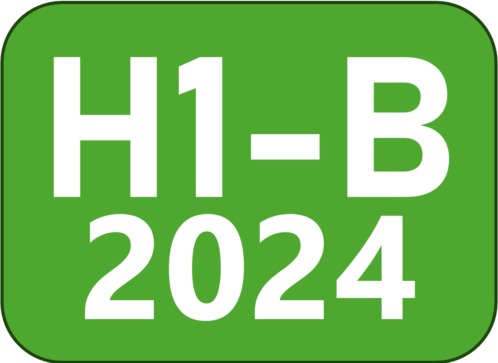

# LinkedIn Sponsorship Keyword Highlighter Extension

Highlights H1B and visa-related keywords in LinkedIn job descriptions, marks companies that sponsored visas in 2024 with a ✓, and adds a sponsorship icon next to company names in the job listing sidebar. Displays a smart, dismissible banner with keyword links and auto-refreshes as you switch job postings.

---

## Features

* Detects and highlights keywords like `H1B`, `visa`, `sponsorship`, `OPT`, `CPT`, etc.
* Detects companies with a green checkmark ✓ that have sponsored visas in 2024, based on the official [USCIS 2024 H-1B Employer Data Hub](https://www.uscis.gov/tools/reports-and-studies/h-1b-employer-data-hub).
* Displays a dismissible banner with:
   - A summary of all detected keywords
   - Links that jump to the keyword location in the job description
   - A tooltip (`ⓘ`) with usage instructions (only shown if keywords are found)
<p align="center">
  <br>
  <small>No keyword detected</small>
</p>

<p align="center">
  <br>
  <small>Sponsorship related keyword detected</small>
</p>

* Adds an  icon next to company names in the job posting sidebar if they are a known visa sponsor
* Smart detection that refreshes highlights and banner when browsing between job listings

---

## Setup & Installation

1. **Download or clone** this repo to your computer:

   ```bash
   git clone https://github.com/vrupak/job-sponsorship-detector.git
   ```

2. **Open Chrome** and go to:

   ```
   chrome://extensions
   ```

3. **Enable Developer Mode** (top-right toggle)

4. Click **"Load unpacked"** and select the `job-sponsorship-detector/` folder

5. Navigate to any LinkedIn job page and click a job listing — keywords should automatically be highlighted and banner displayed.

---

## Note

* Even if some companies show the H1B icon next to them, it’s best to check the banner for confirmation, as they may still require citizenship or similar conditions.
* If there are any highlighted keywords in the banner, make sure to click on them — this will scroll down to where the keyword is mentioned. Be sure to read the full sentence to understand the context in which the keyword is used.
---

## How It Works

* **MutationObserver** watches for dynamic changes when job listings are switched without page reload
* **TreeWalker** scans only text nodes inside the job description and highlights matched keywords
* **Banner** is created and injected with:
  - Custom styles
  - Keyword links with scroll behavior
  - Optional company sponsorship note
  - Dismiss (✖) button that hides the banner until a new job is selected
* **Company CSV** (`data/companies.csv`) is loaded once and matched with the job posting’s company name
* **Sidebar Icons** – Company names in the left job sidebar are also scanned, and known sponsors are marked with an icon.

---

## Known Limitations

* Doesn’t work outside [LinkedIn job pages](https://www.linkedin.com/jobs/)
* Doesn’t currently support saving custom keywords (planned feature)
* Matching company names from the CSV may not be 100% accurate (uses partial matching logic)

---
